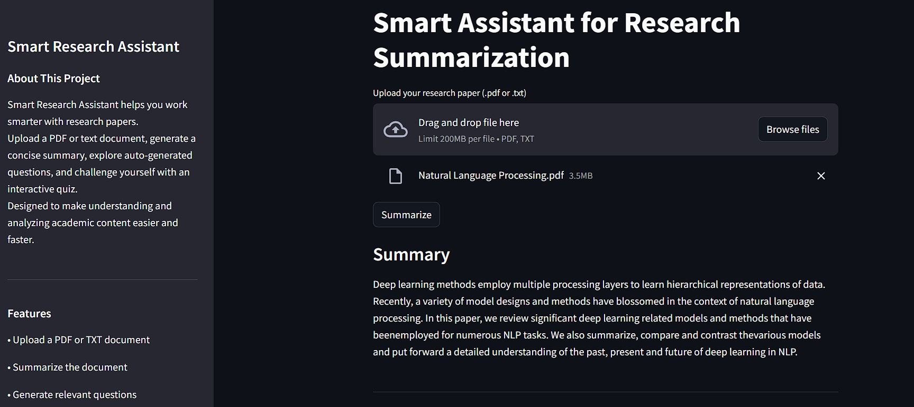
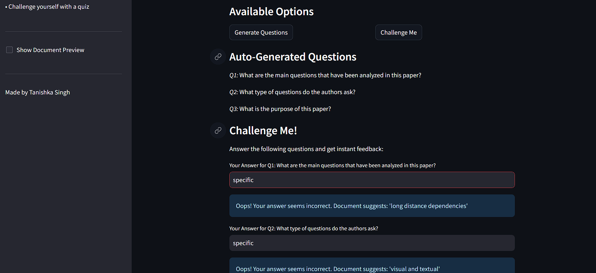

# Smart Research Assistant

An interactive NLP-powered app for summarizing, questioning, and understanding research papers.

---

## Live Demo

Deployed on HuggingFace Spaces :
[Smart Research Assist](https://huggingface.co/spaces/Tanishka27/Smart-Research-Assistant)

Note: Due to free-tier CPU constraints on HuggingFace Spaces, the app may take *a few minutes* to load initially. Please be patient while the models are being loaded.

---

## Screenshots

---

## Features
- Upload PDF or TXT research paper
- Summarize the document using BART
- Auto-generate relevant questions with T5
- Challenge yourself to answer and get feedback
- Optional document preview
- Professional UI/UX with Streamlit

  ---

## Tech Stack
- Streamlit
- Transformers (BART, T5, RoBERTa)
- PyMuPDF
- Scikit-learn

  ---

## Run Locally

1. *Clone this repo:*

    git clone https://github.com/YOUR_USERNAME/Smart-Research-Assistant.git
    cd Smart-Research-Assistant

2. *Install dependencies:*

    pip install -r requirements.txt

3. *Run the app:*

    streamlit run app.py

  ---

## Author

   Tanishka Singh
